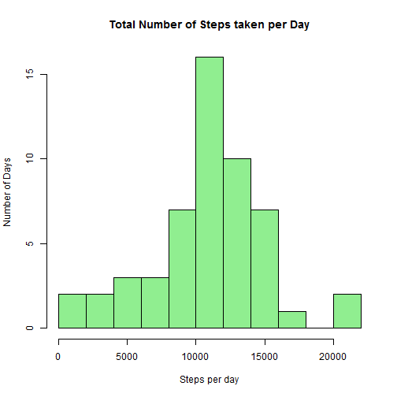
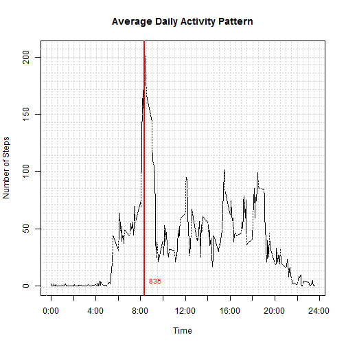
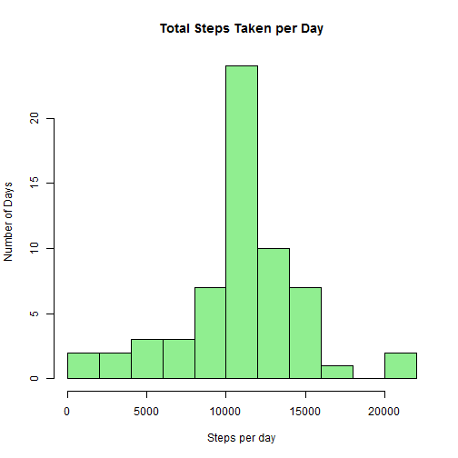
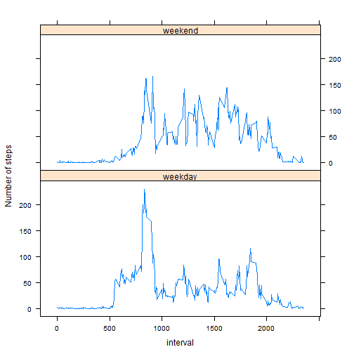

## Loading and preprocessing the data

File **"activity.csv"** consists of two months of data from an anonymous individual collected during the months of October and November, 2012 and include the number of steps taken in 5 minute intervals each day.


The data is loaded into dataset using `read.csv()`. A basic check is done for the availability of the data file.


```r
library(plyr);library(lattice)

errStr <- "acitivity.csv does not exists. Please copy the file into working direcotory"
if(!file.exists("activity.csv")){
    if(!file.exists("activity.zip")){        
        stop(errStr)
    }
    unzip("activity.zip")
}

dataset<-read.csv("activity.csv",stringsAsFactors = FALSE)
```

The date column which is extracted as character is formatted to date object and formatted output displayed.


```r
dataset$date <- as.Date(dataset$date)
str(dataset)
```

```
## 'data.frame':	17568 obs. of  3 variables:
##  $ steps   : int  NA NA NA NA NA NA NA NA NA NA ...
##  $ date    : Date, format: "2012-10-01" "2012-10-01" ...
##  $ interval: int  0 5 10 15 20 25 30 35 40 45 ...
```

## What is mean total number of steps taken per day?

Total steps per day is calculated.


```r
dailyStep <- ddply(dataset, .(date), summarize, steps = sum(steps))
str(dailyStep)
```

```
## 'data.frame':	61 obs. of  2 variables:
##  $ date : Date, format: "2012-10-01" "2012-10-02" ...
##  $ steps: int  NA 126 11352 12116 13294 15420 11015 NA 12811 9900 ...
```

The result contains NA's indicitating missing data which we will igonore for now
The result is plotted in histogram which shows approximately symmetric distribution.


```r
hist(dailyStep$steps, col = "lightgreen", breaks = 10,
     xlab = "Steps per day", ylab = "Number of Days", 
     main = "Total Number of Steps taken per Day")
```

 

Mean and median are calculated with na.rm = TRUE


```r
meanS <- mean(dailyStep$steps, na.rm = TRUE)
medianS <- median(dailyStep$steps, na.rm = TRUE)
meanS; medianS
```

```
## [1] 10766
```

```
## [1] 10765
```

The mean steps per day is **10766.19**.
The median steps per day is **10765**.

## What is the average daily activity pattern?

The time series plot for average number of steps taken, averaged across all days: 

```r
avgStepInt <- ddply(dataset, .(interval), summarize, steps = mean(steps,na.rm=TRUE))

plot( avgStepInt$interval,avgStepInt$steps, type="l",
      main="Average Daily Activity Pattern", axes=FALSE, xlab = "Time", ylab = "Number of Steps")
box(); grid(nx=51,ny=31)
axis(side=2)
axis(side=1, at=seq(0,2400,by=200),labels=paste(seq(0,24,by=2),":00",sep=""))
max <- avgStepInt[which.max(avgStepInt$steps),1]
abline(v=max,col="red",lwd=2)
text(max+100,5,labels = as.character(max),col="red", cex=0.8)
```

 

The maximum steps on average occurs on **835** hours which is shown in plot.


```r
max <- avgStepInt[which.max(avgStepInt$steps),1]
max
```

```
## [1] 835
```

## Imputing missing values

To check the effect of missing values, a new dataset is created replacing NAs with 
mean value of the corresponding interval.


```r
bad <- is.na(dataset$steps)
sum(bad)
```

```
## [1] 2304
```

```r
mean(bad)
```

```
## [1] 0.13
```

Missing values contribute **13.11%**  of the total data.


```r
badInterVal <- dataset[which(bad),3]
naVal <- sapply(badInterVal, function(x){avgStepInt[(avgStepInt$interval == x),2]})
dataset_imp <- dataset
dataset_imp$steps[bad] <- naVal
```

The histogram displays the imputed dataset which is slightly different from the histogram above.


```r
dailyStep_imp <- ddply(dataset_imp, .(date), summarize, steps = sum(steps))
str(dailyStep_imp)
```

```
## 'data.frame':	61 obs. of  2 variables:
##  $ date : Date, format: "2012-10-01" "2012-10-02" ...
##  $ steps: num  10766 126 11352 12116 13294 ...
```

```r
hist(dailyStep_imp$steps, col = "lightgreen", breaks = 10,
     xlab = "Steps per day", ylab = "Number of Days",
     main = "Total Steps Taken per Day")
```

 


```r
meanSI <- mean(dailyStep_imp$steps, na.rm = TRUE)
medianSI <- median(dailyStep_imp$steps, na.rm = TRUE)
meanSI; medianSI
```

```
## [1] 10766
```

```
## [1] 10766
```

The adjusted mean and median are **10766.19** and **10766.19** respectively.  
The mean did not change but median showed slight shift mainly due to missing data for whole day and imputing it with mean value of 5 mins interval.

## Are there differences in activity patterns between weekdays and weekends?

We will check the variation of the data in weekdays and weekends.
Let's create dataframe with factors indicating weekdays and weekends.

```r
checkWeekdays<- function(x){
    x <- weekdays(x)
    if(x=="Sunday"||x=="Saturday") "weekend"
    else "weekday"
}
days <-sapply(dataset_imp$date, checkWeekdays)
dataset_imp <- transform(dataset_imp, days = factor(days))

weekdaysStepInt <- ddply(dataset_imp, .(interval,days), summarize, steps = mean(steps,na.rm=TRUE))
xyplot(steps~interval|days, data=weekdaysStepInt,
       layout = c(1,2), type = 'l', ylab="Number of steps")
```

 

Few information can be inferred from the exploratory analysis.
- Weekend averages show more uniform distribution of data than in weekdays.
- Weekdays has a peak on 8:35 which may correspond to time for leaving to work. 
- Activity starts earlier in weekdays whilst ends late in weekends


